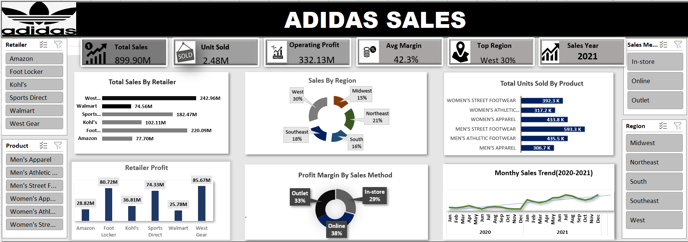

# 👟 Adidas Sales Dashboard

A complete sales performance dashboard for Adidas, designed to analyze revenue, profit, sales trends, regional performance, and product-wise sales.

🚀 Transforming raw sales data into actionable business insights

# 📌 Project Overview

This dashboard helps analyze Adidas sales performance across:

- 🏪 Retailers  
- 🌍 Regions  
- 🛍 Products  
- 💰 Profit Margins  
- 📅 Sales Trends  
- 🛒 Sales Methods  

The dashboard enables quick decision-making through interactive visuals and KPIs.

# 🖼 Dashboard Preview

---

# 🎯 Key KPIs

| KPI | Value |
|-----|-------|
| 💰 Total Sales | **899.90M** |
| 📦 Unit Sold | **2.48M** |
| 💵 Operating Profit | **332.13M** |
| 📈 Avg Margin | **42.3%** |
| 🌍 Top Region | **West (30%)** |
| 📅 Sales Year | **2021** |

---

# 📊 Dashboard Insights

---

## 🏪 Total Sales by Retailer

This chart compares total sales generated by each retailer.

### Key Insights:
🏆 Highest Sales: **West Gear (242.96M)**  
🥈 Second Highest: **Foot Locker (220.09M)**  
🥉 Third Highest: **Sports Direct (182.47M)**  

### Observation:
- West Gear dominates sales performance.
- Amazon generated the lowest sales.

---

## 🌍 Sales by Region

Regional sales contribution across the business.

### Key Insights:

| Region | Sales Share |
|--------|------------|
| West | 30% |
| Northeast | 21% |
| Southeast | 18% |
| South | 16% |
| Midwest | 15% |

### Observation:
- West region contributes the highest sales.
- Midwest contributes the lowest.

---

## 👟 Total Units Sold by Product

Units sold across product categories.

### Key Insights:
🏆 Best Seller: **Men’s Street Footwear (593.3K)**  
🥈 Women’s Apparel: **433.8K**  
🥉 Men’s Athletic Footwear: **435.5K**

### Observation:
- Footwear products dominate unit sales.
- Men’s apparel has the lowest units sold.

---

## 💵 Retailer Profit Analysis

Profit contribution by retailer.

### Key Insights:
🏆 Highest Profit: **West Gear (85.67M)**  
🥈 Foot Locker: **80.72M**  
🥉 Sports Direct: **74.33M**

### Observation:
- West Gear leads in both sales and profitability.
- Walmart generated the lowest profit.

---

## 💳 Profit Margin by Sales Method

Profit contribution based on sales channels.

### Key Insights:

| Sales Method | Profit Share |
|-------------|-------------|
| Online | 38% |
| Outlet | 33% |
| In-store | 29% |

### Observation:
- Online sales generate the highest profit margin.
- In-store contributes the least.

---

## 📈 Monthly Sales Trend (2020–2021)

Tracks monthly sales performance over time.

### Key Insights:
📈 Sales showed overall growth in 2021  
📉 Minor fluctuations observed in mid-year  
📊 Strong finish toward end of 2021  

### Observation:
- Sales trend is positive overall.
- Business growth improved significantly in 2021.

---

# 🎛 Filters / Slicers

This dashboard includes interactive filters for:

✅ Retailer  
✅ Product  
✅ Sales Method  
✅ Region  

These filters allow deeper business analysis.

---

# 🛠 Tools Used

- 📂 Excel  
- 📈 Data Visualization  
- 📉 Dashboard Design  
- 🧹 Data Cleaning  

---

# 🎯 Business Recommendations

### Recommendation 1
Focus more on the **West region** since it drives maximum revenue.

### Recommendation 2
Increase promotions for **Men’s Street Footwear**, as it is the best-selling product.

### Recommendation 3
Improve **In-store sales strategy** to boost profit margin.

### Recommendation 4
Strengthen partnerships with top retailers like **West Gear** and **Foot Locker**.

---

# 🚀 Project Goal

This dashboard helps businesses:

- Improve profitability  
- Understand regional performance  
- Analyze product demand  
- Optimize sales channels  
- Support strategic decision-making  

---

## ⭐ If you like this project, give it a star!

Made with ❤️ using Power BI

